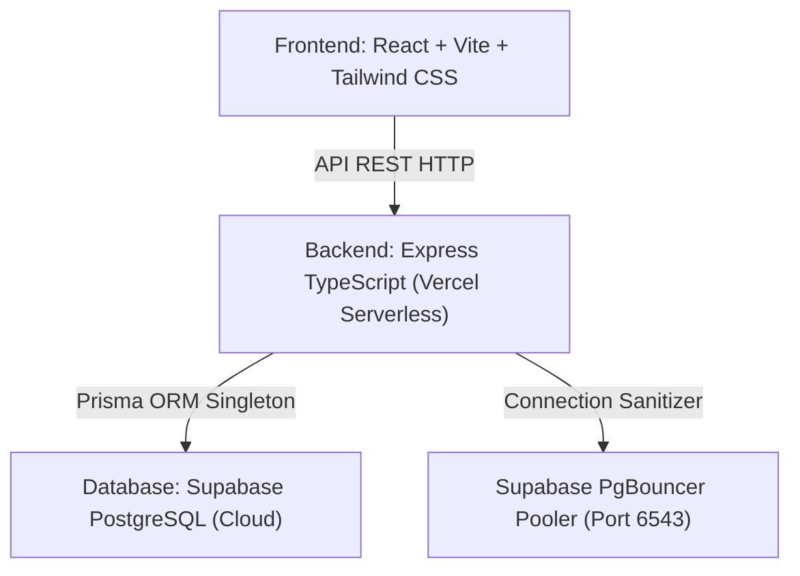

# 🩰 VULPIARE - Sistema de Asistencia & Control de Retiros
> **Resumen de Contexto Técnico y Funcional del Proyecto para Antigravity / Gemini AI Pro**

---

## 📌 1. Visión General del Proyecto
**VULPIARE** es una aplicación web *Mobile-First* diseñada para un estudio de danza y acrobacia aérea. Su propósito es gestionar la asistencia diaria de las alumnas, controlar los retiros de menores por parte de personas autorizadas y brindar un portal accesible a los padres.

- **Repositorio GitHub**: `https://github.com/victoria-benetto/control-asistencia-retiros.git`
- **Producción (`main`)**: [https://control-asistencia-retiros.vercel.app](https://control-asistencia-retiros.vercel.app)
- **Desarrollo / Preview (`develop`)**: [https://control-asistencia-retiros-git-develop-victoria-benetto.vercel.app](https://control-asistencia-retiros-git-develop-victoria-benetto.vercel.app)

---

## 🛠️ 2. Arquitectura & Stack Tecnológico



- **Frontend**: React 18, Vite, TypeScript, Tailwind CSS, Lucide Icons. UI optimizada para teléfonos móviles (barra de navegación inferior fija *touch-friendly*) y computadoras.
- **Backend**: Node.js + Express en TypeScript, modularizado en rutas REST (`auth`, `admin`, `students`, `attendance`, `pickups`).
- **Base de Datos & ORM**: Prisma ORM sobre PostgreSQL hospedado en **Supabase**. Usa Connection Pooler en puerto 6543 con identificador de tenant (`postgres.taxecszkxqwtnxiglwbu`).
- **Infraestructura & CI/CD**: Despliegue en **Vercel** usando Serverless Functions. Cuenta con un autocorrector de conexión en `backend/src/utils/prisma.ts` para garantizar cero fallos de inicialización.

---

## 👥 3. Modelo de Usuarios & Permisos

1. **Super Admin (Victoria - DNI `44122509`)**:
   - Control total del sistema.
   - Acceso exclusivo al ABM de Alumnas (con sus personas autorizadas) y ABM de Profesoras.
   - Definición de contraseñas y permisos modulares.
   - Contraseña oficial única: `Vulpiare2026!`.

2. **Docentes / Profesoras (ej. Profe María - DNI `43213538`)**:
   - Marcación de presencialidad/ausencia por turno.
   - Registro de retiros (estampa hora exacta HH:mm y docente a cargo).
   - Consulta de historial.
   - Acceso con DNI y contraseña asignada por la Super Admin.

3. **Alumnas / Portal de Padres**:
   - Ingreso **estricto por el DNI de la alumna** (`55111222`, etc.).
   - Se restringió el login por DNI del tutor para evitar confusiones.
   - Muestra la presencialidad del día, la hora exacta de retiro, la persona que la retiró, el docente a cargo y el historial de clases pasadas.

4. **Soporte de Doble Rol (Docente + Alumna)**:
   - Si un DNI existe como Docente en un turno y como Alumna en otro, al ingresar el DNI el sistema despliega el selector: *"¿Cómo deseas ingresar hoy?"* (*Como Profesora con contraseña* o *Como Alumna*).

---

## ⏰ 4. Turnos Fijos Oficiales VULPIARE
El sistema opera sobre 4 turnos fijos oficiales:
1. `Lunes, miércoles y viernes de 16:45 a 18`
2. `Lunes, miércoles y viernes de 17:30 a 19`
3. `Martes y Jueves de 16 a 18`
4. `Lunes y miércoles de 8 a 10`

---

## 🚀 5. Funcionalidades Destacadas Implementadas

- **Navegación Histórica y Selección de Fecha**: Selector `<input type="date">` en Asistencia y Retiros para consultar o cargar presencialidad en cualquier fecha pasada o futura.
- **Alumna de Recuperatorio (`+`)**: Permite a las docentes sumar a la lista de la clase de hoy a una alumna perteneciente a otro turno, registrándola con la etiqueta especial **"Recuperatorio"**.
- **Sesión Persistente (`localStorage`)**: La sesión se mantiene abierta incluso si se cierra la solapa o se recarga el navegador, hasta hacer clic explícito en "Cerrar Sesión".
- **Unificación de Interfaz**: Se eliminaron selectores duplicados y se centralizó el control de turnos en las vistas principales.

---

## 📁 6. Estructura del Código

```text
/
├── api/
│   └── index.ts                 # Entrypoint para Serverless Functions de Vercel
├── backend/
│   ├── prisma/
│   │   └── schema.prisma        # Modelos: AdminUser, Student, AuthorizedPerson, AttendanceRecord, PickupRecord
│   └── src/
│       ├── index.ts             # Servidor Express
│       ├── routes/              # auth, admin, student, attendance, pickup
│       └── utils/
│           └── prisma.ts        # Singleton Proxy con Autocorrector de DATABASE_URL
├── frontend/
│   └── src/
│       ├── components/          # LoginView, Navbar, Admin (Student/Admin/Attendance/Pickups/History), ParentPortal
│       ├── services/api.ts      # Cliente Fetch
│       └── types/index.ts       # Definición de tipos TypeScript
├── vercel.json                  # Configuración de rutas e includeFiles para Vercel
└── package.json                 # Scripts de build del Monorepo
```

---

## 🔑 7. Claves & Datos para Pruebas

- **Super Admin**: DNI `44122509` | Contraseña: `Vulpiare2026!`
- **Docente**: DNI `43213538` | Contraseña: `123456`
- **Alumna Pepa**: DNI `55111222` (Ingreso directo sin contraseña)
- **Alumna Pepita**: DNI `55222333` (Ingreso directo sin contraseña)
- **Alumna Popa**: DNI `55333444` (Ingreso directo sin contraseña)
